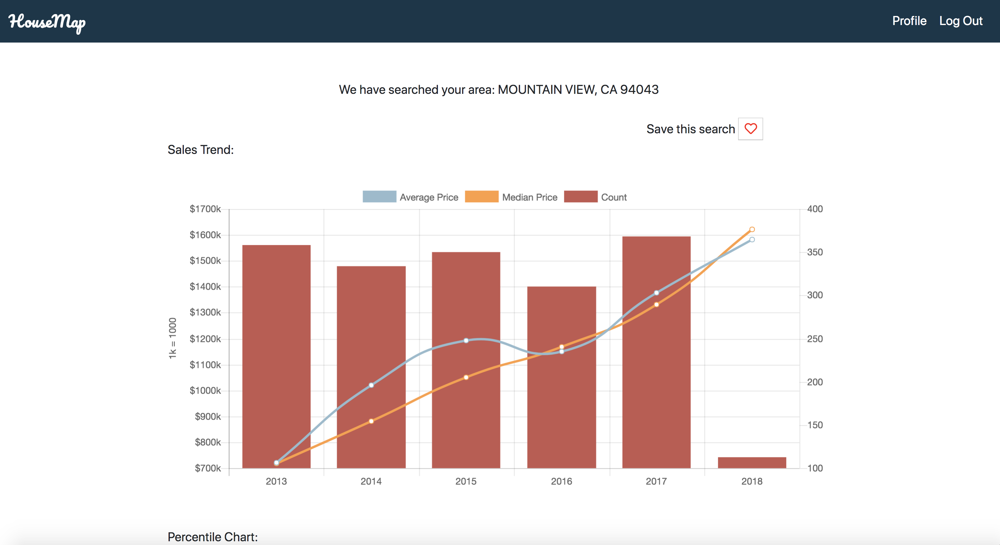
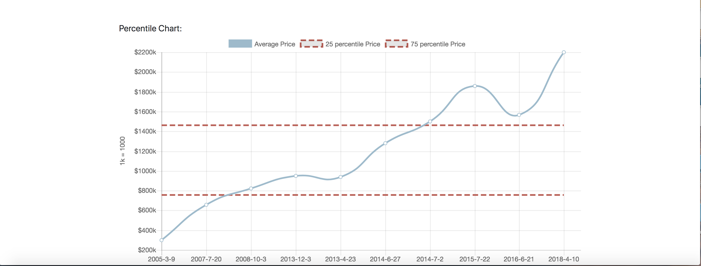
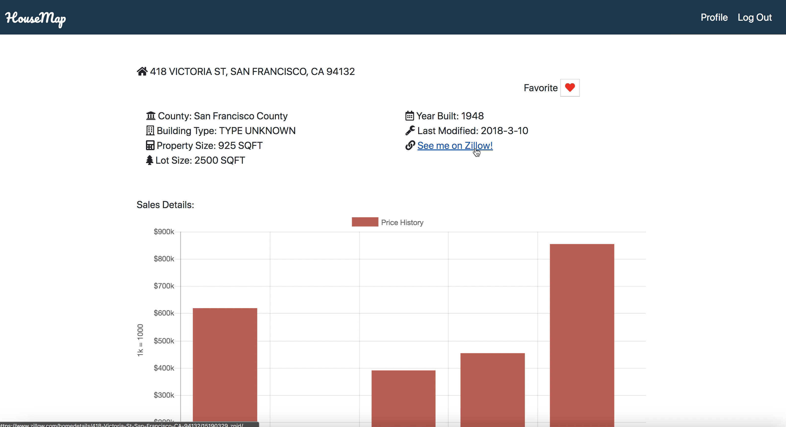
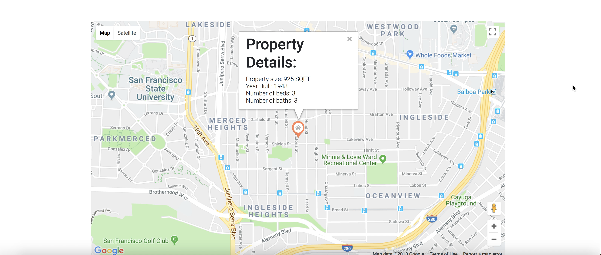

# HouseMap
## Summary
HouseMap is a web app for real estate information search. It supports searching and visualizing property information. Users can search using zip-code, city and address, with options of multiple advanced filters. The app can also return descriptive sales information within a searched region. It can show returned results on a map, with property details in an info window, interactive charts for sales trends and future price predictions. The back-end model is built with a relational database that allows users to save search preferences and the favorite properties.
## About the Developer
HouseMap was created by Tong Zhang, a software engineer in Mountain View, CA. Learn more about the developer on [LinkedIn](https://www.linkedin.com/in/tong--zhang/).
## Tech Stack
Python, Flask, SQLAlchemy, HTML, CSS, Jinja, JavaScript, jQuery and AJAX, ChartJS, PostgreSQL, Bootstrap, Numpy
## API Used
Onboard Informatics API(property data, sales history and  trends), Zillow API(Zillow estimates, Zillow URL), Google Maps API(maps, info windows), Google Places API(autocompletion feature)
## Features 


When users do a zipcode search, they have the option to add some filters showing using jQuery and AJAX. Filters are property type, number of rooms which are optional for the user to narrow down the search result.



The first chart using ChartJS shows the sales history over the past 5 years, including interactive points for average, median with a line chart, and total number counted with a bar chart combined with dual axes.When the users are logged in, the search can be saved to db so the user can do the search again with the most updated results using jQuery and AJAX. 



The second graph shows the 25 and 75 percentile price within this region. The calculation is done through Numpy. The line chart is generated by a subset from 10,000+ results as the prices trend. 


It apply to the city search similarly with advanced filters and also uses Google Places API for autocompletion for city names.


When users do an address search, the auto completion features is also used to avoid invalid inputs.



The results calls Onboard API that returns JSON files that are parsed through backend and the passed back to client using AJAX to display it on this page. By calling Zillow API, I can get the zillow url, the charts shows the price history. User also has the option to save this property.



It also has the feature to build a map to show the property location with an info window about more details.

## Setup/Installation

### Requirements

* PostgreSQL
* Python 2.7
* Onboard and Zillow API, Google APIs(Maps and Places)

Please follow the below steps to have this app running on your computer:

Clone repository:

```
$ git clone https://github.com/zhangtongds/HB-Capstone-project-HouseMap.git
```

Create a virtual environment:

```
$ virtualenv env
```

Activate the virtual environment:

```
$ source env/bin/activate
```

Install dependencies:

```
$ pip install -r requirements.txt
```

Get your own secret keys for [Onborad](https://developer.onboard-apis.com/home) and [Zillow](https://www.zillow.com/howto/api/APIOverview.htm). Save them to a file secrets.py(make sure this is in your git ignore file). Your file should look something like this:

```
export ONBOARD_KEY="abc"
export ZWSID="xyz"
```

Source the key to your terminal:

```
source secrets.sh
```

Create database 'properties':

```
$ createdb properties
```

Create your database tables:

```
$ python model.py
```

If you want to use SQLAlchemy to query the database, run in interactive mode:

```
$ python -i model.py
```

Under interactive mode, run:

```
db.createall()
```

Run the app from the command line:

```
$ python server.py
```

## Looking Forward
* Property recommendations for user using maching learning classfiers.
* Interactive charts where user can filter out results by year, property type, etc.


